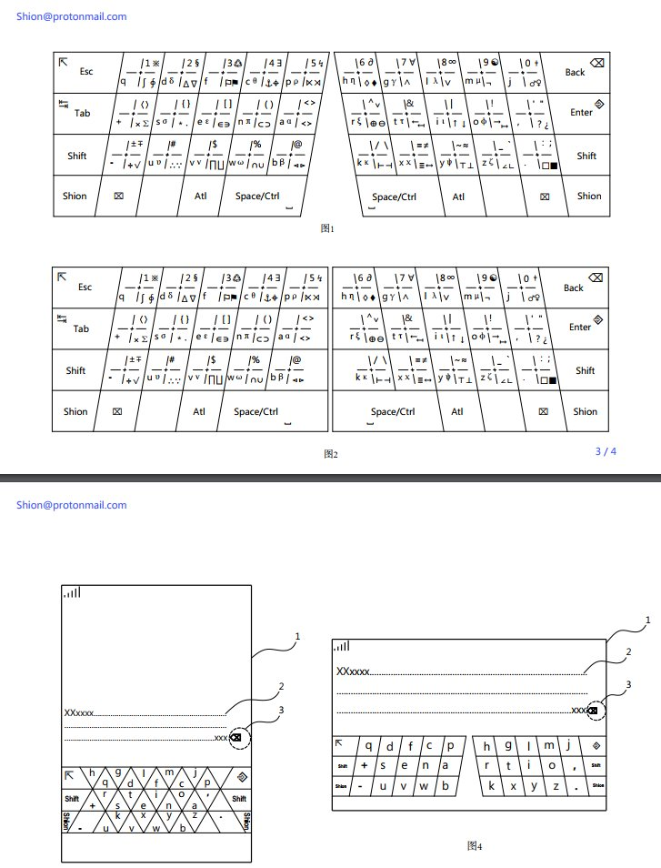
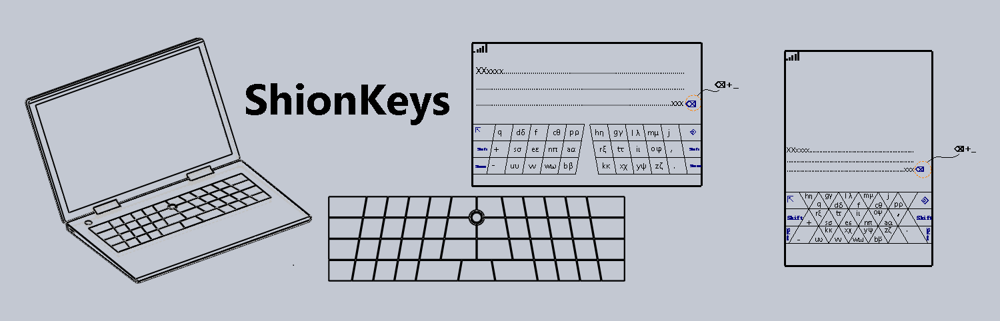

<title>ShionKeys - A Future-oriented Super-simple-ergonomic cross-device keyboard</title>

**I don't own this project, nor do I want to claim ownership of it!** I simply translated it out of curiousity and support. For inquiries about the project itself, please speak to Shion ([Email](mailto:shion@protonmail.com) / [Mastodon](https://mastodon.social/@ShionKeys)), the creator. For inquiries about this translation, please speak to [Austin Huang](https://austinhuang.me) ([Email](mailto:im@austinhuang.me)). Here's the [original text](https://github.com/austinhuang0131/ShionKeys/blob/3e706d8c632d24aeedca89228d9b29f67a366371/README.org) in Chinese.

---

Keyboard is evolved from typewriters. More than 100 years ago, Christopher Latham Sholes designed QWERTY keyboard for typewriters, which is used till now.

The simplest human understanding of keyboard is to use it to type. Professionally, keyboard is defined as a way to communicate between humans and machines, deciding how IT civilization developed (Programming language, etc.). Or, more precisely, the characters on the keyboard decided the form of programming languages, which decided the form of IT civilization.

Before QWERTY, the keys were arranged alphabetically. Anyone can easily find the keys with their sense, which caused fast typing that often jams the typewriter. As a resolution to the problem, QWERTY was designed to scramble the order of characters, which caused difficulties in practicing and decrease in typing speed. Regardless of the conflict between being jammed and use QWERTY, people chose QWERTY and pushed it to the mainstream.

There are many reasons that keyboards after QWERTY never got to the mainstream. However, the main reason is that the newly designed keyboards don't make a significantly positive difference, as well as the same or even more effort of using them leads to an outcome similar to using QWERTY. They also inherited the disadvantages of QWERTY...

A lot of people have tried to bring keyboard closer to human engineering before, however, these keyboards failed as they don't have a simple design, resulting the failure of human engineering being introduced to the public. Keyboards on modern small touch-screen devices have less efficiency than physical ones, and large touch-screen devices requires a horizontally-symmetric and divisible keyboard. The existing keyboard has slowed down developments of some fields, e.g. APL language.

The disadvantage of the current keyboard: Long practice time, difficult for touch-typing (Typing without looking at keyboard), high error rate (Many people cannot even touch-type for all keys, despite years of computer experience. Force a touch-typing will cause an extremely high error rate), is not up to human engineering standard, does not fit in modern devices, slowed down development of some fields (e.g. APL language)...etc.

When the model of computer (aka. Turing machine) was created, it converts mathematical language to machine language for machines to execute, which we have followed to do so. However, the development of civilization and the limitation of characters on the keyboard forced humans to separate machine languages into two parts, which makes it complex: Machine languages cannot be executed by machines directly, but rather converted from mathematical languages by using coding languages and complied into executable code.

As such, the too-young-too-simple-sometimes-naïve me spent a lot of time and loneliness to develop ShionKeys (As shown in the image). It is a cross-device keyboard. People who saw it first will get confused: So many characters, such a complex keyboard...It is definitely not easy to practice or use. That's literally the first reaction of everyone who saw this...However, designing a keyboard without any mulling-over, researches, or creativity, can take less than one day; Copying one only needs minutes, so please do not doubt its usability without understanding it, like I thought emacs was a terrible software when I couldn't shut it off at first, however, I picked it up again and changed my opinions before, thanks to everyone who understands emacs calling it the God in editors.

Although ShionKeys has a lot of characters, it only needs several minutes to remember half of the keys and one day of practice for touch-typing in chats and in offices. You're probably getting surprised and not going to believe it unless you understand it...Anyways, you'll see the details when it starts to be sold (which explains every single characteristic mentioned here), and verify the one-day practice time I said before.

ShionKeys re-creates conditions for computing machines (Turing machines) back to simple models and leads computing languages to literal/direct translation from mathematical languages. To be honest, computing languages will go towards direct translation from math languages without this keyboard anyways, but with more difficulties. Obviously, I meant that the final form of computing languages will be mathematical languages, which will lower the threshold for IT professionals, as it becomes mathematical languages and decreases the length of the code in applications (For developing bigger projects easier), humans will have more time and energy in other things...etc. Also, ShionKeys can make passwords more complex, which means safer data that are difficult to crack.

QWERTY was created to solve the jams in typewriters, Dvorak was created to increase productivity, MATL was created to realize human engineering...

Thanks to all the keyboards existed in the past, ShionKeys was determined to be better before it was even designed. ShionKeys is created to boost/change IT civilization: Super-simple human engineering, cross-device realization (So that all devices have equating productivity), shortest practice time, higher productivity, least keys, more input characters, easiest design to be popularized...

This project will be licensed as a free software in GNU GPL, hardware and design are protected by patents. Nothing is decided before realization, so lots of dreams exist. Plan: Built-in arm Linux, two Ethernet ports, two USB Type C ports, WiFi, Bluetooth... (The goal is the keyboard can be not only just a keyboard but also a computer, the "free software" means it will be programmable, so you can fully customize it as you please.)

I have a vision that every single PC created in the future (Phones, tablets, laptops, desktops, industrial computers...) will use ShionKeys as their standard keyboard. I'm actively working on it.

If you hope an early realization of this project, please support it, spread it, invest in it, or join it. Anyone who fits in the following conditions can join the project:

- Focus, from less to more: lisp, c, python, apl...
- Even if you don't fit the conditions, you can still have a chance to join us if you have a strong will, as we will need different roles, like experts in a specific subject or technology, media, lawyers, etc.

I'm not *that* rich, I don't even know where capitals will go, plus it is literally impossible to get start-up money with current social conditions. Lots of people also want to copy this project, which I'd like you to spit out every penny you earned from it. If you're an "angel" who'd like to lend me a hand, you'll receive a more detailed project plan.

If all plans of fundraising have failed, crowdfunding will be the last resort. As I need to spread this project to everyone before doing so, Indiegogo will be the ideal platform, because Kickstarter does not support mainland China, where crowdfunding is considered illegal. The return for your contribution in crowdfunding is a discount in proportion to your investment which will be applied to every single ShionKeys product made in the future, and free products if your investment is higher than the retail price.

Email: [Shion@protonmail.com](mailto:shion@protonmail.com)

<video width="100%" controls>
  <source src="https://files.mastodon.social/media_attachments/files/002/585/328/original/c64a254d185c5fe9.mp4" type="video/mp4">
Your browser does not support the video tag.
</video>

*Translated November 5, 2017 in Montréal, Canada. 1st revision at December 19, 2017.*

---

Sidenote on April 4, 2018: I noticed that the original creator's GitHub was deleted. GitHub did not provide a detailed reason, but the creator mentioned that [he has contacted multiple tech companies for investments before](https://forums.freebsd.org/threads/the-final-form-of-the-keyboard-shionkeys.63143/page-2#post-382596), which puts the ban under equal responsibility of both parties. I do not support the author's effort to post this around global forums nor sending emails to tech companies. As of now, I'm trying to get this product spread out in non-intrusive ways. If you do like this project, I'd ask you to support him too, so that he can at least not walk on the path of mass-posting after being supressed (Or at least he felt so) by GitHub, Twitter, and Indiegogo.
